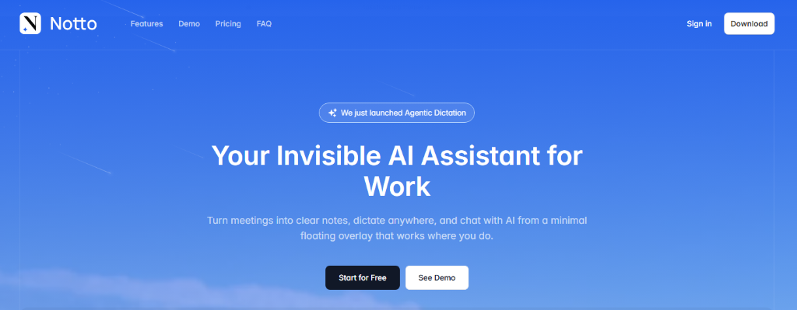

# ⚡ Notto - Your Invisible AI Assistant for Work

**Master your workflow with AI-powered notes, meetings, and chat.**

[**Download Latest Release**](https://github.com/anghelmatei/notto-releases/releases/latest) • 
[**Visit Website**](https://usenotto.com) • 
[**Contact Support**](mailto:mateialexandruang@gmail.com)

---

## ✨ Features

**Notto** is designed to keep you in the flow. Turn meetings into clear notes, dictate anywhere, and chat with AI from a minimal floating overlay that works where you do.

*   🎙️ **Voice-First Design**: Dictate notes, emails, and ideas with high-accuracy transcription.
*   🧠 **Invisible AI Overlay**: Chat with AI instantly, wherever you work and do it discreetly in any meeting (doesn't show in screen sharing).
*   📅 **Meeting Companion**: Transcribe meetings with AI and generate action items automatically.

---

## 📥 Installation Guide

Since Notto is a new application, you might see security warnings from your operating system. This is normal! Follow the steps below to install safely.

### 🪟 Windows

1.  **Download** the `.exe` installer.
2.  Double-click to run. You may see a **"Windows protected your PC"** popup.
3.  Click **"More info"**.
4.  Click **"Run anyway"**.
5.  Wait for the installation to complete. Notto will launch automatically!

### 🍎 macOS

1.  **Download** the `.dmg` file.
2.  Open the file and drag **Notto** to your **Applications** folder.
3.  **Right-click** (or Control-click) the Notto app icon.
4.  Select **"Open"** from the menu.
5.  Click **"Open"** again in the dialog box.
    *   *Note: If you just double-click, macOS might block it. Right-clicking is the secret key!* 🔑

### 🐧 Linux

1.  **Download** the `.AppImage` file.
2.  Right-click the file and go to **Properties**.
3.  Go to the **Permissions** tab.
4.  Check **"Allow executing file as program"**.
5.  Double-click to launch!

---

## ❓ FAQ

**Q: Why do I see a security warning?**
A: Notto is an independent new project and we haven't purchased expensive code-signing certificates yet. The app is completely safe and secure.

**Q: Is my voice data recorded?**
A: Audio is processed for transcription and then discarded. We prioritize your privacy.

**Q: Can I use Notto offline?**
A: Yes! Manual note taking features work offline. AI features require an internet connection (for now, will add local model support in the future).

---

Made with ❤️ by [Matei Anghel](https://github.com/anghelmatei)

